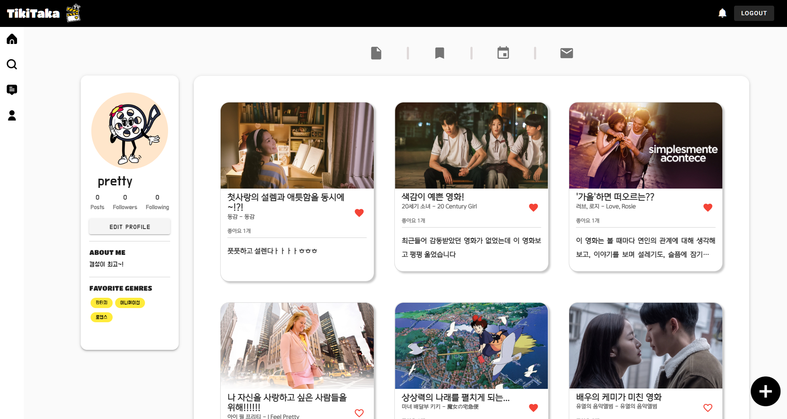

# MovieProject

# 1. 팀원 정보 및 업무 분담 내역

- 협업 - 기획, 디자인, 프론트 디테일
- 김정원 - 프론트엔드 총괄
- 서다경 - 백엔드 총괄

---

# 2. 목표 서비스 구현 및 실제 구현 정도

### 기획 의도

- 사용자 경험 중심으로 토의
    - 어떻게 사용자 경험을 개선할 수 있을까?
    - 사용자에게 어떤 새로운 경험을 줄 수 있을까?
- 일종의 영화 인스타그램
    - 영화를 주제로 한 **이미지 기록 중심의 커뮤니티**
- 기획했던 굵직한 기능들은 대부분 구현한 것 같음

---

# 3. 데이터베이스 모델링 (ERD)

- 이미지 중심의 커뮤니티이므로, 여러 종류의 이미지로 영화를 나타낼 수 있어야함. 따라서 DB를 탄탄하게 구성함.

## Movies

- 약 2,000개의 영화
- 약 10,000명의 영화인
- 약 20,000개의 영화 관련 이미지

## Accounts

- 소셜 로그인을 위한 이메일 기반 유저 모델
- 팔로잉, 메세지, 북마크

## Commuity

- 리뷰, 캘린더, 덧글, 좋아요

---

# 4. 서비스 대표 기능

## 📑 영화 조회 및 맞춤형 영화 추천 서비스

### A. 자동완성 검색

- 입력하는 글자마다 DB에 요청을 보내 유저가 찾고자 하는 검색어를 일종의 자동완성 방식으로 우선적으로 제시함
- 장르적 요소도 함께 고려하여 원하는 장르에 한해 검색 가능

### B. 다양한 정보 제공

- 영화 상세 페이지에서 유저가 알고 싶어 할 정보들을 담아 출력
    - 영화를 제공 중인 OTT 서비스
    - 제작국가
    - 캐스팅 및 감독
    - 예고편

### C. 맞춤형 영화 추천

- 직접 개발한 알고리즘을 이용하여 사용자별 맞춤 영화 서비스 제공

## 📑 개인화 기록 서비스를 토대로한 이미지 중심 커뮤니티 서비스

### A. 각자 자신만의 방법으로 기록

- 영화 감상문 피드 작성
- 관심있는 영화 북마크 설정
- 영화 포스터를 이용하여 나만의 달력 꾸미기

### B. 유저 간 의견 공유 서비스

- 팔로우 유저라면 팔로우한 유저의 기록물을 함께 감상 가능 (단, 수정은 작성자만 가능!)
- 게시된 피드에 대해 댓글 및 좋아요 기능으로 자신의 의견 공유 가능
- 팔로우한 유저에 다이렉트로 영화를 추천할 수 있는 메시지 전송 가능

---

# 5. 영화 추천 알고리즘

## 🎬 추천 기획

### A. 특정 영화 관련 영화 추천

- 영화 디테일 페이지에서 영화와 연관된 추천 영화 출력한다.

### B. 사용자 맞춤 영화 추천

- 사용자가 북마크 해둔 영화를 기반으로 한 영화 추천한다.
- 모든 추천 목록에서, 사용자가 이미 북마크/리뷰 남긴 영화를 제외해 보다 사용자에게 적합한 추천을 실행한다.

## 🎬 추천 알고리즘

### A. 시리즈 연관

- 영화 제목 사이의 연관성을 측정하여, 유사도에 따라 추천 여부 결정

### B. 감독

- 해당 영화의 감독의 작품 중 평점 수 상위 작품을 추천

### C. 장르

- 해당 영화의 장르 작품 중 평점 수 상위 작품을 추천

### D. 평점 수

- 신뢰도 높은 지수 (vote count) 선정

---

# 6. 후기

- 개발하면서 끊임없이 소통해서 명확한 기획과 추진력 있는 개발이 가능했다. 개발에서의 소통의 중요성을 다시금 깨달았다.
- 페어와 함께 ‘사용자 경험’을 치열하게 고민해서 아무리 사소한 부분이라도 개선하려고 애를 썼다. 이 경험으로 크게 성장한 것 같다.
- 백엔드와 프론트엔드 개발 시 유의할 점을 배울 수 있었다. 구체적으로 json data의 형식과 URL에 있어서 합의와 규칙이 필요하다는 것을 피부로 느꼈다.

- 컴포넌트 재사용은 충분한 설계가 되었을 때 사용하자…..!
- 프론트엔드의 컴포넌트와 백엔드의 serializer, model 등에서 팀원이 공유하는 시각화된 구조가 절실했다.
- 시간 관계상 구현하지 못한 부분이 아쉽다.
    - 영화 MBTI
    - 카카오톡 로그인
    - 영화 상세 페이지에서 해당 영화 기반으로 작성한 피드를 모아 좋아요 순으로 출력
    - 홈 화면의 영화 예고편 컴포넌트 3d carousel 적용
    - 완전한 서버 배포
